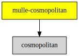

# 

#### 


### You are here




## Add

Use [mulle-sde](//github.com/mulle-sde) to add  to your project.
As long as your sources are using `#include "include-private.h"` and your headers use `#include "include.h"`, there will nothing more to do:

``` sh
mulle-sde add :/
```

To only add the sources of  with dependency
sources use [clib](https://github.com/clibs/clib):

## Legacy adds

One common denominator is that you will likely have to add
`#include </.h>` to your source files.


### Add sources to your project with clib

``` sh
clib install --out src/ /
```

Add `-isystem src/` to your `CFLAGS` and compile all the
sources that were downloaded with your project. (In **cmake** add
`include_directories( BEFORE SYSTEM src/)` to your `CMakeLists.txt`
file).


### Add as subproject with cmake and git

``` bash
git submodule add -f --name "cosmopolitan" \
                            "https://github.com/mulle-cc/cosmopolitan/archive/refs.git" \
                            "stash/cosmopolitan"
git submodule add -f --name "" \
                            "https://github.com//" \
                            "stash/"
git submodule update --init --recursive
```

``` cmake
add_subdirectory( stash/)
add_subdirectory( stash/cosmopolitan)

target_link_libraries( ${PROJECT_NAME} PUBLIC )
target_link_libraries( ${PROJECT_NAME} PUBLIC cosmopolitan)
```


## Install

Use [mulle-sde](//github.com/mulle-sde) to build and install :

``` sh
mulle-sde install --prefix /usr/local \
   https://github.com///archive/latest.tar.gz
```

### Legacy Installation


Download the latest [tar](https://github.com///archive/refs/tags/latest.tar.gz) or [zip](https://github.com///archive/refs/tags/latest.zip) archive and unpack it.

Install **** into `/usr/local` with [cmake](https://cmake.org):

``` sh
cmake -B build \
      -DCMAKE_INSTALL_PREFIX=/usr/local \
      -DCMAKE_PREFIX_PATH=/usr/local \
      -DCMAKE_BUILD_TYPE=Release &&
cmake --build build --config Release &&
cmake --install build --config Release
```


## Author

[Nat!](https://mulle-kybernetik.com/weblog) for Mulle kybernetiK  


